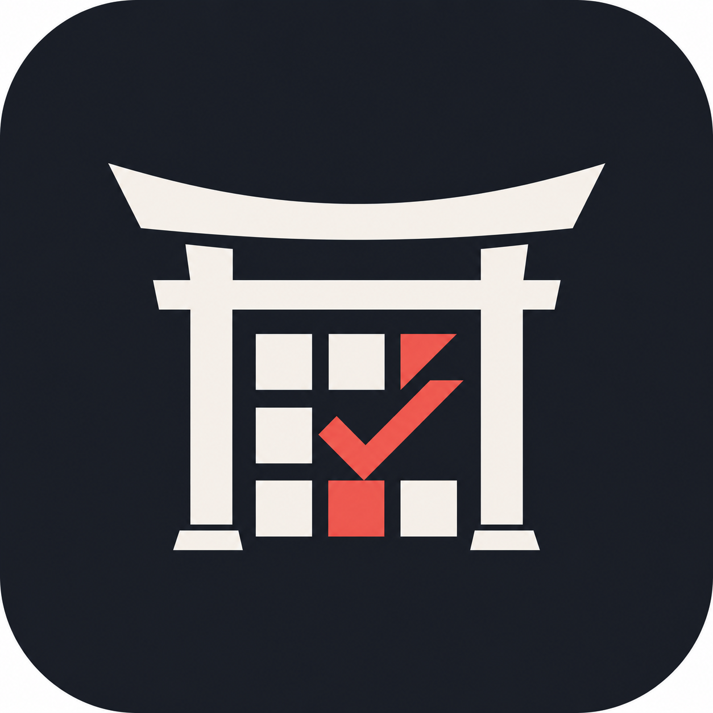

# Dojo Manager

> **¿Preferís leerlo en castellano?** [La versión completa en castellano está más abajo.](#versión-en-castellano)

**A management platform built around the real daily work of a jiu-jitsu academy.**

Dojo Manager brings students, attendance, monthly fees, overdue accounts, teacher payouts, graduations, and occasional apparel campaigns into one operational system.

This repository is the public product showcase. The application source code and production infrastructure are private.

> **Public demo:** being prepared with fictional data and infrastructure isolated from the academy’s live operation.

## The problem

Running an academy often means combining spreadsheets, messages, payment notes, attendance lists, and calculations that depend on one person remembering how everything works.

That fragmentation creates duplicated work, incomplete history, hard-to-audit teacher payouts, and limited visibility into what needs attention.

## The product

Dojo Manager turns those workflows into a single, traceable experience:

| Area | Value delivered |
| --- | --- |
| Dashboard | A clear monthly overview and direct access to priority work |
| Students | Profiles, plans, belts, status changes, and activity history |
| Attendance | Fast mobile-first registration with teacher and class traceability |
| Payments | Monthly fees, due dates, overdue accounts, cancellations, and reminders |
| Settlements | Reproducible teacher payouts based on collected fees and valid attendance |
| Teacher access | Focused operational access without exposing administrative finances |
| Apparel | Campaign orders, partial collections, costs, profitability, and delivery |
| Settings | Plans, teachers, recurring classes, payout rules, and message templates |

## What makes it different

- Designed from real academy operations, not from a generic management template.
- Preserves business history instead of silently overwriting past information.
- Distinguishes physical attendance from attendance eligible for teacher settlement.
- Keeps payment corrections and exceptions auditable.
- Supports teachers without giving them access to sensitive administrative areas.
- Handles occasional apparel production without pretending to be a full online store.

## Product principles

- Administrative work should be fast enough to perform during a class.
- Important calculations should be understandable and reproducible.
- Permissions must protect sensitive workflows, not only hide navigation.
- Product rules and long-term decisions should remain documented.
- Public demonstrations must use fictional data and isolated infrastructure.

## Product and engineering case study

The [case study](./CASE_STUDY.md) explains the problem, product decisions, main workflows, engineering approach, and lessons behind Dojo Manager.

## Current status

- Used in the day-to-day operation of a real jiu-jitsu academy.
- Private production application and data.
- Public, code-free showcase.
- Isolated interactive demo in preparation.

## Built by

Dojo Manager was conceived, designed, and developed by [NicoLopezBjj](https://github.com/NicoLopezBjj).

For professional conversations, interviews, or product enquiries, please contact me through my GitHub profile.

---

# Versión en castellano

**Una plataforma de gestión construida alrededor del trabajo cotidiano real de una academia de jiu-jitsu.**

Dojo Manager reúne alumnos, asistencias, cuotas mensuales, deuda, liquidaciones docentes, graduaciones y campañas ocasionales de indumentaria en un único sistema operativo.

Este repositorio es la presentación pública del producto. El código fuente de la aplicación y la infraestructura productiva son privados.

> **Demo pública:** en preparación con datos ficticios e infraestructura aislada de la operación real de la academia.

## El problema

Administrar una academia suele implicar combinar planillas, mensajes, anotaciones de pagos, listas de asistencia y cálculos que dependen de que una sola persona recuerde cómo funciona todo.

Esa fragmentación genera trabajo duplicado, historial incompleto, liquidaciones difíciles de auditar y poca visibilidad sobre lo que requiere atención.

## El producto

Dojo Manager convierte esos procesos en una experiencia única y trazable:

| Área | Valor que aporta |
| --- | --- |
| Dashboard | Panorama mensual claro y acceso directo al trabajo prioritario |
| Alumnos | Perfiles, planes, cinturones, cambios de estado e historial de actividad |
| Asistencias | Registro rápido y mobile-first con trazabilidad de clase y profesor |
| Pagos | Cuotas, vencimientos, deuda, anulaciones y recordatorios |
| Liquidaciones | Pagos docentes reproducibles según cobros y asistencias válidas |
| Acceso docente | Operación específica sin exponer finanzas administrativas |
| Indumentaria | Pedidos por campaña, cobros parciales, costos, rentabilidad y entregas |
| Configuración | Planes, profesores, clases recurrentes, reglas y plantillas |

## Qué lo diferencia

- Nace de la operación real de una academia, no de una plantilla genérica.
- Conserva el historial de negocio en lugar de sobrescribir silenciosamente el pasado.
- Distingue la asistencia física de la que corresponde computar en una liquidación.
- Mantiene auditables las correcciones de pagos y las excepciones.
- Permite que los profesores trabajen sin acceder a áreas administrativas sensibles.
- Gestiona producciones ocasionales de indumentaria sin convertirse en una tienda genérica.

## Principios del producto

- La administración debe ser lo bastante rápida como para realizarse durante una clase.
- Los cálculos importantes deben poder comprenderse y reproducirse.
- Los permisos deben proteger procesos sensibles, no limitarse a ocultar navegación.
- Las reglas y decisiones de largo plazo deben permanecer documentadas.
- Toda demostración pública debe utilizar datos ficticios e infraestructura aislada.

## Caso de estudio de producto e ingeniería

El [caso de estudio](./CASE_STUDY.md) explica el problema, las decisiones de producto, los flujos principales, el enfoque de ingeniería y los aprendizajes detrás de Dojo Manager.

## Estado actual

- Utilizado en la operación cotidiana de una academia real de jiu-jitsu.
- Aplicación productiva y datos privados.
- Showcase público sin código.
- Demo interactiva aislada en preparación.

## Creado por

Dojo Manager fue concebido, diseñado y desarrollado por [NicoLopezBjj](https://github.com/NicoLopezBjj).

Para conversaciones profesionales, entrevistas o consultas sobre el producto, podés contactarme desde mi perfil de GitHub.
